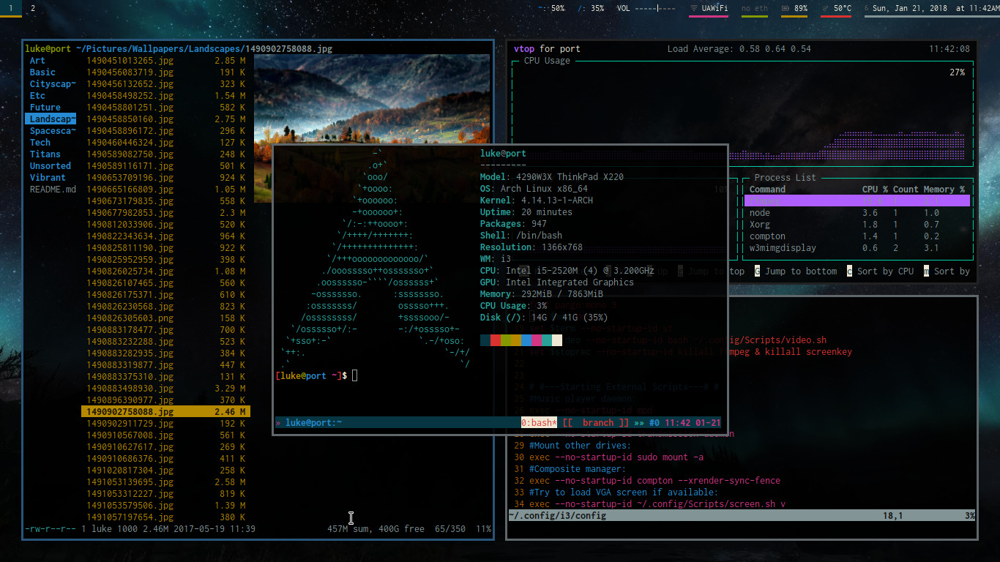

# Luke's GNU/Linux Rice

There are my dotfiles! The name of the repo, "voidrice", came from the fact they were originally on my Void Linux machine, but these files are distro-independent. In fact, I now push changes from my X200 running Parabola or my X220 running Arch.

## Programs whose configs can be found here

+ i3 (i3-gaps)
+ urxvt (rxvt-unicode) (although these files use [my st build](https://github.com/lukesmithxyz/st) as the default terminal)
+ vim
+ bash
+ ranger
+ qutebrowser
+ ~~mutt/msmtp/offlineimap~~ Now moved to [LukeSmithxyz/mutt-wizard](https://github.com/LukeSmithxyz/mutt-wizard)
+ calcurse
+ ncmpcpp and mpd (my main music player)
+ Music on Console (moc and mocp as an alternative music player)
+ mpv
+ neofetch
+ compton (For transparency and to stop screen tearing)
+ And many little scripts I use

## More documentation

Check other config folders for more specific documentation.

[i3 guide and config](.config/i3/i3_guide.rmd)

[ranger configuration](.config/ranger/luke_ranger_readme.md)

## Dynamic Configuration Files

Store your favorite or high-traffic folders in `~/.config/Scripts/folders` or your most important config files in `~/.config/Scripts/configs` with keyboard shortcuts. When you add things to theses files my vimrc will automatically run `~/.config/Scripts/shortcuts.sh` which will dynamically generate shortcuts for these in bash, ranger and qutebrowser!

Check out more info at the main repo for this: [shortcut-sync](https://github.com/lukesmithxyz/shortcut-sync). You will really want to take advantage of this for an extremely efficient setup!

## Like my rice?

Feel free to add other suggestions and I may implement them.

I have a job, but every penny I get from followers or subscribers is more incentive to perfect what I'm doing. You can donate to me at [https://paypal.me/LukeMSmith](https://paypal.me/LukeMSmith). Donations are earmarked for whatever the donator wants, usually to go to funds for buying new equipment for the [YouTube channel](https://youtube.com/c/LukeSmithxyz).

# Programs Used

+ i3-gaps, NetworkManager, compton
+ Terminal apps -- ranger, ncmpcpp, mpd, htop, weechat, neomutt, calcurse, newsbeuter, transmission-remote-cli, w3m, youtube-dl, ffmpeg, scrot
+ Background stuff -- mpd, transmission
+ Lightweight non-terminal apps -- mupdf, feh, rofi, network manager applet, arandr, mpv
+ Big business programs -- qutebrowser, GIMP, Blender
