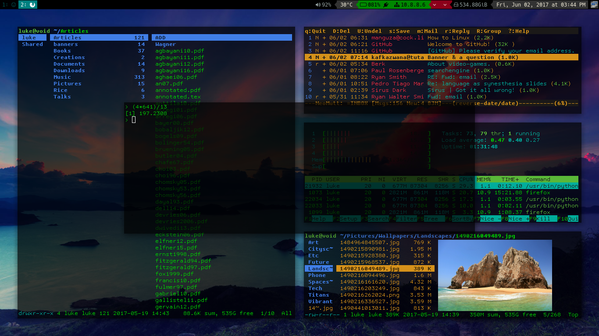

# Luke's Void Linux Rice

These are the files to my Void Linux Rice.

## Programs whose configs can be found here

+ i3 (i3-gaps)
+ urxvt (rxvt-unicode)
+ vim
+ bash
+ ranger
+ mutt/msmtp/offlineimap (For offline syncing of email, with configs easy to change to a gmail account)
+ calcurse
+ Music on Console (moc and mocp)
+ mpv
+ neofetch
+ compton (For transparency and to stop screen tearing)
+ And many little scripts I use

## More documentation

Check other config folders for more specific documentation. For example [config mutt](.config/mutt/) contains documentation on how to set up mutt with your email account.

## Dynamic Configuration Files

One of the most notable parts of my setup is that my ~/.bashrc and configs for ranger and qutebrowser are dynamically synchronized with by `~/.config/Scripts/shortcuts.py`. Each config file has a "base" form to which directory shortcuts are added and synchronized every time i3 refreshes or when you press Super+F2.

Each of these programs have shortcuts to edit config files and to go to or move files to certain directories. Each time `shortcuts.py` is run, the pairs in both `~/.config/Scripts/folders` and `~/.config/Scripts/configs` are put in the syntax of each application and the 

### What does this mean?

1. You can easily add directory shortcuts in `~/.config/Scripts/folders` (just type cff in bash) or aliases to configs in `~/.config/Scripts/configs` (just type cfc in bash).
2. Each time you run `shortcuts.py`, this script takes the input from the above files and puts it in the required syntax for bash, ranger and qutebrowser.
3. This keeps all your configs in sync and you can use the same shortcuts in each program and allows you to add more easily as you need them for your folder structure.

**Note: to have persistent changes in bash or ranger configs, be sure to edit not ~/.bashrc (which is replaced each time), but ~/.config/Scripts/bashrc, which is the base that `shortcuts.py` builds off of.** There is already the alias of `cfb` to edit this file. **Just remember to run `shortcuts.py` (Super+F2) after to apply the changes.**

### That's confusing!

Then simply remove the line in the i3 config that runs `shortcuts.py` and then edit configs as usual.

## ~/.config Centrality

Some programs, like mocp, tmux, mutt, calcurse and weechat look to `~` and not `~/.config` for their dotfiles. This annoys me since I like using Syncthing to sync my config files accross machines.

To avoid this, I have bash aliases and i3 shortcuts that run these programs looking in `~/.config/` instead for their files. This makes managing files easier for me.

You can easily change this if you want. As I decrease the number of machines I use anyway, I may gradually stop doing this.

## Differences from my Arch and Parabola Rices

+ **Since Void is more or less my main distro now, this repo is more likely to get updates over time.** The Arch and Parabola repos may get some, changes, but will remain mostly the same.
+ Void uses a different pacakge manager and init system than Arch/Parabola, thus some of the relevant shortcuts have been changed.
+ This rice uses ALSA only, and **not** PulseAudio. This makes for a more minimal system, but there is some functionality of the Parabola rice not present here yet, specifically, I don't have a way of recording system sounds yet, or using music visualizers. If you have more experience than me in getting these to work, please email me your solution! [luke@lukesmith.xyz](mailto:lukesmith.xyz)
+ I use only Firefox on my Void Machine, not qutebrowser, so there are no qutebrowser configs here.

## Note on dependencies

As of now, I've listed most of the dependencies in a script in the main directory. I don't think list is exhaustive, so if you find another program that my rice requires, please notify me so I can add it for the facility of other users! Again, my mail is at [luke@lukesmith.xyz](mailto:luke@lukesmith.xyz).

## Like my rice?

Feel free to add other suggestions and I may implement them.

I have a job, but every penny I get from followers or subscribers is more incentive to perfect what I'm doing. You can donate to me at [https://paypal.me/LukeMSmith](https://paypal.me/LukeMSmith). Donations are earmarked for whatever the donator wants, usually to go to funds for buying new equipment for the [YouTube channel](https://youtube.com/c/LukeSmithxyz).
