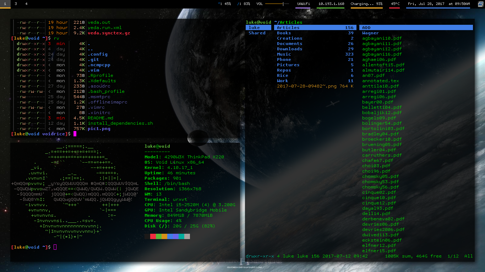

# Luke's GNU/Linux Rice

There are my dotfiles! The name of the repo, "voidrice", came from the fact they were originally on my Void Linux machine, but these files are distro-independent. In fact, I now push changes from my X200 running Parabola.

## Programs whose configs can be found here

+ i3 (i3-gaps)
+ urxvt (rxvt-unicode)
+ vim
+ bash
+ ranger
+ qutebrowser
+ mutt/msmtp/offlineimap (For offline syncing of email, with configs easy to change to a gmail account)
+ calcurse
+ ncmpcpp and mpd (my main music player)
+ Music on Console (moc and mocp)
+ mpv
+ neofetch
+ compton (For transparency and to stop screen tearing)
+ And many little scripts I use

## More documentation

Check other config folders for more specific documentation. For example [config contains documentation on how to set up mutt with your email account.

[i3 guide and config](.config/Scripts/i3_guide.md)

[Email configuration](.config/mutt/email.md) 

[ranger configuration](.config/ranger/ranger.md) 

## Dynamic Configuration Files

One of the most notable parts of my setup is that my ~/.bashrc and configs for ranger and qutebrowser are dynamically synchronized with by `~/.config/Scripts/shortcuts.py`. Each config file has a "base" form to which directory shortcuts are added and synchronized every time i3 refreshes or when you press Super+F2.

Each of these programs have shortcuts to edit config files and to go to or move files to certain directories. Each time `shortcuts.py` is run, the pairs in both `~/.config/Scripts/folders` and `~/.config/Scripts/configs` are put in the syntax of each application, added to the base configs, and the plopped in the appropriate location.

### What does this mean?

1. You can easily add directory shortcuts in `~/.config/Scripts/folders` (just type cff in bash) or aliases to configs in `~/.config/Scripts/configs` (just type cfc in bash).
2. Each time you run `shortcuts.py`, this script takes the input from the above files and puts it in the required syntax for bash, ranger and qutebrowser.
3. This keeps all your configs in sync and you can use the same shortcuts in each program and allows you to add more easily as you need them for your folder structure.

**Note: to have persistent changes in bash or ranger configs, be sure to edit not ~/.bashrc (which is replaced each time), but ~/.config/Scripts/bashrc, which is the base that `shortcuts.py` builds off of.** There is already the alias of `cfb` to edit this file. **Just remember to run `shortcuts.py` (Super+F2) after to apply the changes.**

### That's confusing!

Then simply remove the line in the i3 config that runs `shortcuts.py` and then edit configs as usual.

## Like my rice?

Feel free to add other suggestions and I may implement them.

I have a job, but every penny I get from followers or subscribers is more incentive to perfect what I'm doing. You can donate to me at [https://paypal.me/LukeMSmith](https://paypal.me/LukeMSmith). Donations are earmarked for whatever the donator wants, usually to go to funds for buying new equipment for the [YouTube channel](https://youtube.com/c/LukeSmithxyz).

# Some dependencies

+ i3-gaps, NetworkManager,compton
+ Terminal apps -- ranger, ncmpcpp, mpd, htop, weechat, neomutt, calcurse, newsbeuter, transmission-remote-cli, w3m, youtube-dl, ffmpeg, scrot
+ Background stuff -- mpd, transmission
+ Lightweight non-terminal apps -- mupdf, feh, rofi, network manager applet, arandr, mpv
+ Big business programs -- Firefox, GIMP, Blender

# With Bumblebee Status:

